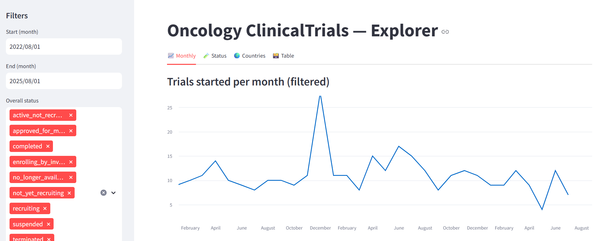

# Oncology Clinical Trials – Data Pipeline & Dashboard

This project is a **data pipeline and interactive dashboard** that ingests, processes, and visualizes information about oncology clinical trials from [ClinicalTrials.gov](https://clinicaltrials.gov/).

The main goal was to build an end-to-end example of a modern data stack:
- **Airflow** – orchestration of daily ingestion jobs  
- **Postgres (warehouse)** – raw and processed storage  
- **dbt** – SQL transformations and data modeling  
- **Streamlit** – interactive data exploration  

---

## How it works

1. **Ingestion**  
   An Airflow DAG (`ctgov_pipeline`) fetches oncology clinical trials daily from the ClinicalTrials.gov API and loads them into Postgres (`raw_ctgov` tables).

2. **Transformation**  
   dbt models clean and aggregate the data into `staging` and `marts` schemas.  
   Example: monthly trial starts (`cancer_trials_monthly`).

3. **Visualization**  
   A Streamlit app (`app/app.py`) connects to the warehouse and provides an interactive dashboard with:
   - Trends of trial starts over time
   - Breakdown by recruitment status
   - Top countries
   - Full searchable/filterable trial table

---

## Quick start

1. Clone the repo:
   ```bash
   git clone https://github.com/leticiapleite/oncology-clinical-trials-pipeline.git
   cd oncology-clinical-trials-pipeline
   docker compose up -d

2. Open services:
  - Airflow → http://localhost:8080
  - Streamlit app → http://localhost:8501

By default, the Airflow web UI is configured with a development login (username: `admin`, password: `admin`).  
These credentials are for local testing only and should be changed if running in any shared or production environment.


---

## Example

Here’s a quick glimpse of the dashboard:



---

## Notes

* The pipeline is scheduled daily in Airflow, so the app stays updated.
* This is a demo project built to learn and showcase orchestration, dbt modeling, and dashboarding in a unified workflow.

---
## Data & Ethics
This project uses public data from ClinicalTrials.gov. Please respect the terms of use. The repository is for learning and demonstration purpos